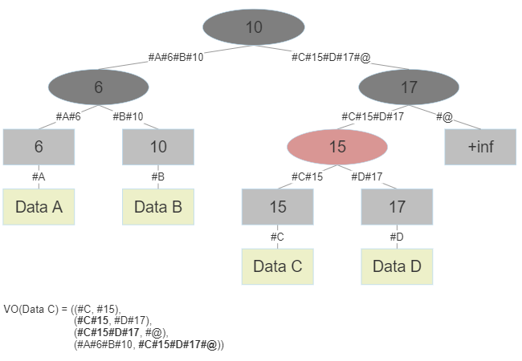

# Red-Black Merkle Tree

An efficient authenticated data structure
based on generic Red-Black Tree with Merkle augmentation.

## Contents

- [Red-Black Merkle Tree](#red-black-merkle-tree)
  - [Contents](#contents)
  - [Theory](#theory)
  - [Usage](#usage)
    - [`MRBT` class](#mrbt-class)
      - [Constructors](#constructors)
      - [Attributes](#attributes)
      - [Methods](#methods)
    - [`verify` function](#verify-function)
  - [TODO](#todo)
  - [References](#references)

## Theory

|  |
| :---------------------------------------------: |
|    Red-Black Merkle Tree with fictive leaf.     |

See the [original implementation](#references) for basic understanding.

We added fictive leaf with infinity key to the original implementation. That way data structure acquires strict key bijection between internal nodes and leaves (each finite leaf has key of its closest ancestor in whose left subtree it lies).

Data is stored in finite keyed leaves of Red-Black Tree. Each node has also a pair of digests similar to Merkle trees for data
authentication.

## Usage

### `MRBT` class

#### Constructors

- `MRBT(hsh=sha256_dual)`
  - `hsh` is a function used for Merkle augmentation, takes 2 `bytes` objects and returns their combined hash `bytes`.
- `MRBT.from_iter(itr, **kwargs)`
  - `itr` is iterable of either keys (for `None` values) or key-value pairs for initial state, keys must be `int` and values must be json-serializable.
  - `**kwargs` are additional keywords passed to original constructor (only `hsh` keyword supported yet).
- `MRBT.from_dict(dct, **kwargs)`
  - `dct` is a key-value `dict` object, keys must be `int` and values must be json-serializable.
  - `**kwargs` are additional keywords passed to original constructor (only `hsh` keyword supported yet).

#### Attributes

- `size`
  - Number of keys stored.
- `digest`
  - Root digest of the structure.

#### Methods

- `insert(key, val=None)`
  - Inserts `key` key with `val` value, `val` must be json-serializable. Ignores existing keys.
- `delete(key)`
  - Deletes `key` key from the storage. Ignores missing keys.
- `get(key, verified=False)`
  - Returns stored `key` key value if `verified` is false.
  - Returns pair of stored key value and verification object if `verified` is true.
  - Returns `None` if key is missing and `verified` is false.
  - Returns `None, None` pair if key is missing and `verified` is true.
- `set(key, val=None)`
  - Updates `key` key value with `val` if key exists, inserts it otherwise, `val` must be json-serializable.
- `by_keys_order(k, as_json=False)`
  - List-alike indexing for `k`'th ordered `key` object, supports negatives for reversed order.
  - Returns `{'key': <key>, 'value': <value>}` `dict` if `as_json` is false, its json `str` otherwise.
  - Returns `None` if `k` is out of range.
- `get_change_set(other, as_json=False)`
  - Returns comparison result over `other` `MRBT` object in `[[<target>, {'key': <key>, 'value': <value>}], ...]` `list` format if `as_json` is false, its json `str` otherwise.
    - `<target>` is either `'Source'` for `self` or `'Destination'` for `other`, `<key>` and `<value>` is a point of difference (either key is unique to the collection or values differ).
  - **!!!** Incorrect results rate is controlled by hash function choice.
- `__len__()`
  - Allows `len(self)` for getting `size` attribute.
- `__iter__(as_json=False)`
  - Allows `for item in self` iterating. Yields `{'key': <key>, 'value': <value>}` `dict` objects if `as_json` is false, its json `str` otherwise.
- `__contains__()`
  - Allows `key in self` checks, returns `True` if `key` key exists, `False` otherwise.
- `__getitem__(key)`
  - Allows `self[key]` getting, returns `key` key stored value.
  - Returns `None` if key is missing.
- `__setitem__(key, val)`
  - Allows `self[key] = val` setting, updates `key` key value with `val` if key exists, inserts it otherwise, `val` must be json-serializable.
  - `set` method analogue.
- `__eq__(other)`
  - Allows `self == other` probabilistic morphism checks.
  - **!!!** False positive rate is controlled by hash function choice.
- `__str__(self)`
  - Allows `print(self)` printing for basic visualization.

### `verify` function

- `verify(t, vo, hsh=sha256_dual)`
  - Validation for verification object `vo`, trusted `MRBT` object `t` and same `hsh` dual argument hashing function. Returns `True` if validation passed, `False` otherwise.

## TODO

- Develop `test.py` for testing the structure.
- Clean the code up.

## References

- [1] Original Python 2 implementation:
  - [Red-Black Merkle Tree](https://github.com/amiller/redblackmerkle) - Andrew Miller (2012).
